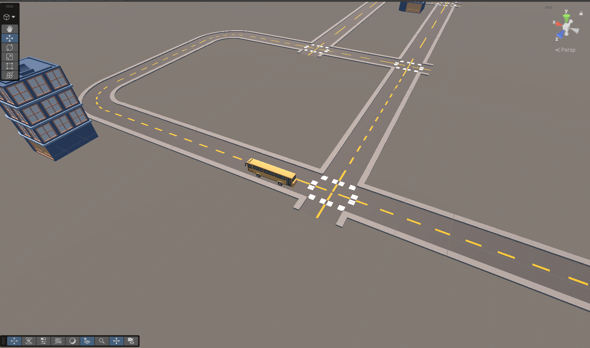

# Agent-Based Autonomous Campus Transit — Unity

A simulation of an **agent-based, demand-responsive campus bus system**, built in Unity. Passengers
appear at stops throughout a simulated day (seeded, rush-hour-peaked demand); intelligent software
agents route a capacity-limited bus to serve them, and the system is **measured against a fixed-route
baseline under identical demand**. It is the first prototype of a digital-twin campus transit platform —
routing, scheduling, and monitoring are pure C# so a future sensor-based autonomous vehicle can be
dropped in behind a stable seam without touching the logistics.



## What it does

One bus serves passenger trip requests over a road network auto-generated from the scene's tiles. Two
routing "brains" run over the **same** demand stream so they can be compared:

- **Dynamic** — a route-optimization agent inserts each request's pickup + drop-off into the bus plan
  using a capacity-aware insertion heuristic that minimises passengers' cumulative service time.
- **FixedRoute** (baseline) — the bus loops all stops in a fixed order regardless of demand (the
  status-quo campus shuttle).

Metrics (wait, ride, total time, occupancy, empty-travel distance) are written to CSV for analysis and
shown live on an on-screen HUD.

## Architecture

The system is two layers with a clean seam between them.

### Simulation layer — agents over a blackboard (all plain C#)

Ticked in fixed order by the `Simulation` MonoBehaviour on a fixed sim-timestep:

| Component | Responsibility |
|-----------|----------------|
| `Blackboard` | Shared world state (sim time, seeded RNG, requests, bus state, metrics, mode). |
| `SimClockAgent` | Advances sim time; ends the run after the configured day length. |
| `DemandAgent` | Spawns requests via a seeded Poisson process shaped by `PeakProfile` (morning/evening peaks). |
| `RouteOptimizerAgent` + `InsertionPlanner` | Dynamic brain: capacity-aware, precedence-respecting insertion minimising passenger service time. |
| `FixedRouteAgent` | Baseline brain: fixed cyclic loop of all stops. |
| `Dispatch` | Executes the plan — boards/alights generically at each stop; leg travel is driven by **sim time** (route length ÷ cruise speed), so the whole simulation is deterministic and framerate-independent. |
| `GraphRouter` | Dijkstra shortest path over the weighted road graph (memoised per node pair). |
| `MonitorAgent` | Live HUD text + per-run CSV export to `Results/`. |

### Physical / world layer (from the road-exploration foundation)

| Component | Responsibility |
|-----------|----------------|
| `RoadGraph` | Serialized nodes + edges (with center-line polylines and lengths), auto-built from the road tiles (menu: **Bus System ▸ Build Road Graph**). |
| `BusStop` | Each building bound to its nearest graph node — a routing target. |
| `BusPathFollower` | Kinematic waypoint follower — animates the physical bus. |
| `IVehicleNavigator` / `KinematicNavigator` | The **actuator seam**. Today `KinematicNavigator` drives `BusPathFollower` (visual only). Later an `IsaacNavigator` / `AWSIMNavigator` with LiDAR/proximity obstacle avoidance implements the same interface — **zero change** to demand, routing, scheduling, or metrics. |
| `CameraFollow` | Isometric eagle-eye camera that tracks the bus. |

Because leg completion is driven by the sim clock rather than render frames, the full simulated day runs
**headlessly and deterministically** (same seed → identical metrics) in well under a second — the physical
`BusPathFollower` bus is purely a visualization of the logical state.

## Results

A/B run over identical seeded demand (seed 12345, 16 h day, 4 stops, one 20-seat bus, cruise 0.25 —
the loaded / peak regime). Written to `Results/`:

| Metric | Dynamic | FixedRoute |
|--------|--------:|-----------:|
| Passengers delivered | **263** | 245 |
| Left unserved | **59** | 77 |
| p90 wait | **15 460 s** | 16 300 s |
| Empty-travel distance | **253** | 1 313 |
| Avg wait | 8 668 s | 8 415 s |

Under load the demand-responsive controller delivers **more** passengers, strands **fewer**, has a better
worst-case (p90) wait, and drives **~5× less empty** — a large efficiency gain — at essentially tied
average wait. The advantage is clearest under congestion; with only four stops a fixed loop is naturally
efficient at light load (see [Next steps](Docs/NEXT_STEPS.md) for how the gap widens with more stops and
peaked demand).

## Running it

**Headless A/B (recommended — fast & deterministic):** the simulation is plain C# and runs without play
mode. In the Unity editor, use the `unity-mcp` `RunCommand` harness (or a small editor menu) to build the
`Blackboard` + agent list for each `RunMode` and tick to `Blackboard.Finished`. Both `Dynamic_*.csv` and
`FixedRoute_*.csv` land in `Results/`.

**Live visualization:**
1. Open the project in **Unity 6000.5.3f1** (Built-in Render Pipeline) and open `Assets/Scenes/SampleScene.unity`.
2. Run **Bus System ▸ Build Road Graph** if you've moved/added road tiles (otherwise it's already built and saved).
3. Press **Play.** The `Simulation` object drives the bus; the HUD shows live counters and the camera follows in an isometric view. Set its `Mode` field to `Dynamic` or `FixedRoute`, and tune `BusCruiseUnitsPerSimSecond`, `BaseRatePerStopPerHour`, `SimDurationHours`, `RandomSeed` in the Inspector.

## Project layout

```
Assets/
  Scenes/SampleScene.unity        # Roads / Buildings / Vehicles / RoadGraph / Simulation
  Scripts/BusSystem/              # runtime agents + system, plus Editor/ build tool
  Road_Tiles/ , Loading Games/    # art: modular road pack + Toon City pack
Docs/
  specs/ , plans/                 # design specs and implementation plans
  NEXT_STEPS.md                   # prioritized roadmap
Results/                          # A/B metrics CSVs (per-passenger + summary per mode)
```

## Roadmap

See **[Docs/NEXT_STEPS.md](Docs/NEXT_STEPS.md)** for the prioritized backlog — sharpening the A/B result
(peaked demand, more stops), fleet coordination (multiple buses), demand forecasting, congestion-aware
costs, and the stage-2 sensor-based autonomous navigator behind `IVehicleNavigator`.

## Notes

- URP is installed but intentionally inactive; the scene uses Built-in Standard shaders.
- If scripts don't compile after a Unity upgrade, check for packages using obsolete APIs
  (`TreeView`, `GetInstanceID`) — this project pins `com.unity.inputsystem` ≥ 1.19.0 and drops unused
  packages (ai.navigation, timeline, collab-proxy, visualscripting).
- The simulation is deterministic: a given seed + mode + parameters always produces identical metrics.
