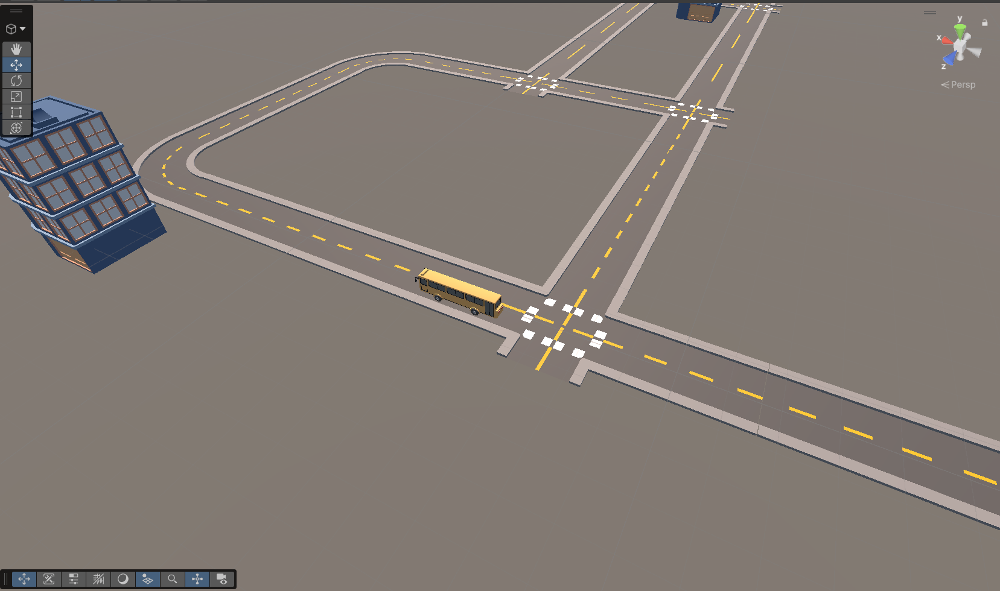

# Agent-Based Autonomous Campus Transit — Unity

A simulation of an **agent-based, demand-responsive campus bus system**, built in Unity. Passengers
appear at stops throughout a simulated day (seeded, rush-hour-peaked demand); intelligent software
agents dispatch a fleet of capacity-limited buses to serve them, and the system is **measured against a
fixed-route baseline under identical demand**. It is the first prototype of a digital-twin campus transit platform —
routing, scheduling, and monitoring are pure C# so a future sensor-based autonomous vehicle can be
dropped in behind a stable seam without touching the logistics.



## What it does

A fleet of buses serves passenger trip requests over a road network auto-generated from the scene's
tiles. Two routing "brains" run over the **same** demand stream so they can be compared:

- **Dynamic** — a centralized fleet optimizer assigns each request to the best bus, inserting each request's pickup + drop-off into the bus plan
  using a capacity-aware insertion heuristic that minimises passengers' cumulative service time.
- **FixedRoute** (baseline) — the buses run a shared, sensibly-ordered loop of all stops regardless
  of demand (the status-quo campus shuttle).

Metrics (wait, ride, total time, occupancy, empty-travel distance) are written to CSV for analysis and
shown live on an on-screen HUD.

## Architecture

The system is two layers with a clean seam between them.

### Simulation layer — agents over a blackboard (all plain C#)

Ticked in fixed order by the `Simulation` MonoBehaviour on a fixed sim-timestep:

| Component | Responsibility |
|-----------|----------------|
| `Blackboard` | Shared world state (sim time, seeded RNG, requests, bus state, metrics, mode). |
| `SimClockAgent` | Advances sim time; ends the run after the configured day length. |
| `DemandAgent` | Spawns requests via a seeded Poisson process shaped by `PeakProfile` (morning/evening peaks). |
| `FleetOptimizerAgent` + `InsertionPlanner` | Dynamic brain: assigns each request to the bus with the cheapest **marginal** capacity-aware insertion (centralized — see [ADR 0001](Docs/adr/0001-centralized-fleet-assignment.md)). |
| `FixedRouteFleetAgent` + `StopTour` | Baseline brain: N buses share one nearest-neighbour loop of all stops, phase-offset by their start positions ([ADR 0002](Docs/adr/0002-fair-fixed-route-fleet-baseline.md)). |
| `Dispatch` (one per bus) | Executes that bus's plan — boards/alights generically at each stop; leg travel is driven by **sim time** (route length ÷ cruise speed), so the whole simulation is deterministic and framerate-independent. |
| `GraphRouter` | Dijkstra shortest path over the weighted road graph (memoised per node pair). |
| `MonitorAgent` | Live HUD + activity feed; per-passenger, summary, and **per-bus** CSV export to `Results/`. |

### Physical / world layer (from the road-exploration foundation)

| Component | Responsibility |
|-----------|----------------|
| `RoadGraph` | Serialized nodes + edges (with center-line polylines and lengths), auto-built from the road tiles (menu: **Bus System ▸ Build Road Graph**). |
| `BusStop` | A building (or `Stops` marker) bound to its nearest graph node, with a demand `Weight` — a routing target. |
| `BusPathFollower` | Kinematic waypoint follower — animates the physical bus. |
| `IVehicleNavigator` / `KinematicNavigator` | The **actuator seam**. Today `KinematicNavigator` drives `BusPathFollower` (visual only). Later an `IsaacNavigator` / `AWSIMNavigator` with LiDAR/proximity obstacle avoidance implements the same interface — **zero change** to demand, routing, scheduling, or metrics. |
| `CameraFollow` | Isometric eagle-eye camera that tracks the bus. |

Because leg completion is driven by the sim clock rather than render frames, the full simulated day runs
**headlessly and deterministically** (same seed → identical metrics) in well under a second — the physical
`BusPathFollower` bus is purely a visualization of the logical state.

## Results

Deterministic headless A/B over identical seeded demand (seed 12345, 16 h day, **10 stops**
with two hubs, 20-seat buses, cruise 0.25). Reproduce with **Bus System ▸ Run Fleet Sweep** →
`Results/sweep.csv`.

### Fleet scaling (demand 6 req/stop/h — the congested regime)

| Buses | Dynamic delivered | FixedRoute delivered | Dynamic empty-travel | FixedRoute empty-travel |
|------:|------------------:|---------------------:|---------------------:|------------------------:|
| 1 | **326** | 276 | 377 | 440 |
| 2 | **577** | 508 | 649 | 854 |
| 3 | **756** | 680 | **256** | 3 080 |
| 4 | **1 014** | 871 | **1 046** | 2 495 |

Demand-responsive routing delivers **11–18 % more passengers** at every fleet size, and both
modes show diminishing returns as buses are added.

### Load sensitivity (3 buses) — where demand-response actually pays off

| Demand rate | Requests | Dynamic served | FixedRoute served | Dynamic empty | FixedRoute empty |
|------------:|---------:|---------------:|------------------:|--------------:|-----------------:|
| 1.0 | 221 | 84.2 % | **86.0 %** | **2 263** | 10 796 |
| 2.0 | 462 | 84.0 % | **85.1 %** | **1 323** | 6 682 |
| 3.0 | 720 | **85.8 %** | 77.6 % | **749** | 3 627 |
| 4.5 | 1 098 | **64.2 %** | 56.1 % | **492** | 2 492 |
| 6.0 | 1 456 | **51.9 %** | 46.7 % | **256** | 3 080 |

**The headline finding is a crossover.** At light load the two are effectively tied on
throughput — a fixed loop is naturally efficient when it can visit every stop often enough, and
it is marginally ahead (~1 pp). From roughly **3 requests/stop/hour** upward the fixed route
saturates while the demand-responsive controller keeps pace, opening an **8-point** gap in
passengers served.

**Empty running is the unambiguous win:** Dynamic drives **4–12× less empty distance at every
load** — the clearest operational-cost argument for demand-responsive dispatch.

### Honest caveats

- Under heavy congestion Dynamic's **p90 wait is not better** (20 705 s vs 19 540 s at rate 6):
  it serves more people overall, but greedy one-shot assignment leaves a tail of passengers
  committed to a busy bus. Reassignment (see the roadmap) is the fix.
- `DeliveredCoV` (per-bus utilisation balance, 0 = perfectly even) shows the fleet is **not**
  evenly loaded — a measured consequence of greedy assignment plus hold-in-place idling, which
  the metric exists to expose rather than hide.

## Running it

**Headless A/B + sweep (recommended — fast & deterministic):** the simulation is plain C# and runs
without play mode. In the Unity editor run **Bus System ▸ Run Fleet Sweep**: it sweeps fleet size (1–4)
and demand rate for both modes under one seed and writes `Results/sweep.csv` in a couple of seconds.

**Live visualization:**
1. Open the project in **Unity 6000.5.3f1** (Built-in Render Pipeline) and open `Assets/Scenes/SampleScene.unity`.
2. Run **Bus System ▸ Build Road Graph** if you've moved/added road tiles (otherwise it's already built and saved).
3. Press **Play.** The `Simulation` object instantiates `BusCount` buses at distributed stops and drives them; the HUD shows live counters plus a passenger activity feed, and the camera follows bus 0 in an isometric view. Tune `BusCount`, `Mode`, `BusCruiseUnitsPerSimSecond`, `BaseRatePerStopPerHour`, `SimDurationHours`, `RandomSeed` in the Inspector.
4. To add stops, drop empty markers under a `Stops` object and re-run **Build Road Graph**; set a stop's `Weight` above 1 to make it a demand hub.

## Project layout

```
Assets/
  Scenes/SampleScene.unity        # Roads / Buildings / Vehicles / RoadGraph / Simulation
  Scripts/BusSystem/              # runtime agents + system, plus Editor/ build tool
  Road_Tiles/ , Loading Games/    # art: modular road pack + Toon City pack
CONTEXT.md                        # domain glossary
Docs/
  specs/ , plans/                 # design specs and implementation plans
  adr/                            # architecture decision records
  NEXT_STEPS.md                   # prioritized roadmap
rc_transit/                       # physical sim-to-real sub-project (ROS 2 + ESP32)
Results/                          # metrics CSVs (per-passenger, summary, per-bus, sweep)
```

## Roadmap

See **[Docs/NEXT_STEPS.md](Docs/NEXT_STEPS.md)** for the prioritized backlog. Fleet coordination and the
world enrichment it needed are **done**; next up are **request reassignment** (the fix for the p90 tail
and utilisation imbalance above), anticipatory repositioning via demand forecasting, congestion-aware
edge costs, and the stage-2 sensor-based navigator behind `IVehicleNavigator`.

**Physical sim-to-real (separate sub-project).** A real Ackermann RC vehicle doing autonomous
LiDAR-SLAM + Nav2 navigation between checkpoints — its own standalone system with a "request A→C"
interface, kept out of `Assets/` under [`rc_transit/`](rc_transit/README.md). Design:
**[Docs/specs/2026-08-16-physical-rc-transit-design.md](Docs/specs/2026-08-16-physical-rc-transit-design.md)**.

## Notes

- URP is installed but intentionally inactive; the scene uses Built-in Standard shaders.
- If scripts don't compile after a Unity upgrade, check for packages using obsolete APIs
  (`TreeView`, `GetInstanceID`) — this project pins `com.unity.inputsystem` ≥ 1.19.0 and drops unused
  packages (ai.navigation, timeline, collab-proxy, visualscripting).
- The simulation is deterministic: a given seed + mode + parameters always produces identical metrics.
- Domain vocabulary is pinned in [`CONTEXT.md`](CONTEXT.md); design decisions are recorded in [`Docs/adr/`](Docs/adr/).
